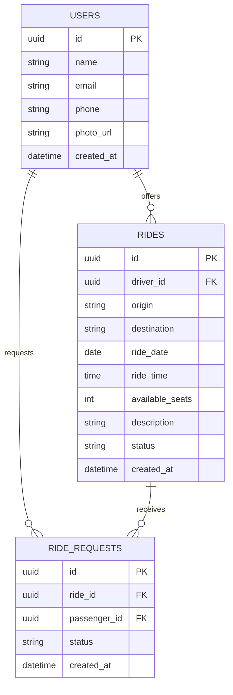

# 🚗 CaronAí

### Plataforma de caronas da UTFPR

**CaronAí** é uma aplicação web desenvolvida para facilitar a conexão entre estudantes da UTFPR que oferecem ou procuram caronas, promovendo uma alternativa de deslocamento mais prática, econômica e colaborativa.

O projeto faz parte do **UTFApps**, portal de aplicações desenvolvido no contexto acadêmico da UTFPR.

---

## 👥 Autores

* **Gabriel Campos Manzole**
* **[Nome do integrante 2]**
* **[Nome do integrante 3]**

---

## 📋 Descrição do Projeto

O **CaronAí** tem como objetivo centralizar e simplificar o processo de oferta e busca de caronas entre estudantes da UTFPR.

A plataforma permite que usuários publiquem caronas informando dados como origem, destino, data, horário e quantidade de vagas disponíveis. Outros usuários podem pesquisar as caronas disponíveis e solicitar uma vaga.

A aplicação busca proporcionar uma experiência simples, segura e organizada para conectar pessoas que possuem trajetos semelhantes.

### 🎯 Objetivos

* Facilitar a busca por caronas entre estudantes;
* Permitir a publicação e gerenciamento de caronas;
* Reduzir custos de deslocamento;
* Incentivar o compartilhamento de veículos;
* Aproximar estudantes que realizam trajetos semelhantes;
* Oferecer uma experiência digital simples e intuitiva.

---

## 📚 Documentação Técnica

A documentação técnica do projeto está disponível na pasta `/docs`.

* 📄 [PRD](./docs/prd.md)
* 📐 [SSD](./docs/ssd.md)
* ✅ [Checklist](./docs/checklist.md)

---

## 🗄️ Modelagem de Dados



> O modelo será evoluído conforme as regras de negócio e os requisitos definidos durante o desenvolvimento.

---

## 🎨 Protótipo

O protótipo navegável da aplicação foi desenvolvido no **Stitch/Figma**.

🔗 [**Acessar protótipo**](#)

---

## 🛠️ Stack Tecnológica

### Front-end

* **Angular**
* **TypeScript**
* **[Framework CSS]**

### Backend / BaaS

* **[BaaS escolhido]**

### Bibliotecas

* **[Biblioteca 1]**
* **[Biblioteca 2]**
* **[Biblioteca 3]**

---

## 🌐 Aplicação em Produção

🔗 [**Acessar CaronAí**](#)

> O link será atualizado após o deploy da aplicação.

---

## 💻 Execução Local

### Pré-requisitos

Antes de executar o projeto, certifique-se de possuir:

* [Node.js](https://nodejs.org/)
* npm
* Angular CLI
* Git

### 📥 Instalação

Clone o repositório:

```bash
git clone [URL_DO_REPOSITORIO]
```

Entre na pasta do projeto:

```bash
cd caronai-utfpr
```

Instale as dependências:

```bash
npm install
```

Execute a aplicação:

```bash
ng serve
```

A aplicação estará disponível em:

```text
http://localhost:4200
```

---

## 🖥️ Telas da Aplicação

### 🏠 Página Inicial


### 🔎 Busca de Caronas


### 🚗 Publicação de Carona


### 👤 Perfil


> As imagens serão adicionadas conforme o desenvolvimento da aplicação.

---

## 🌱 Proposta

O **CaronAí** busca contribuir para a comunidade acadêmica da UTFPR por meio de uma solução digital que incentive a colaboração entre estudantes e facilite o deslocamento até o campus.

A plataforma pretende tornar o processo de encontrar e oferecer caronas mais simples, organizado e acessível, promovendo também o compartilhamento de recursos e a aproximação entre estudantes com trajetos semelhantes.

---

## 📄 Licença

Este projeto foi desenvolvido para fins acadêmicos no contexto da **UTFPR**.

---

<div align="center">

### 🚗 CaronAí

**Conectando caminhos na UTFPR.**

</div>
